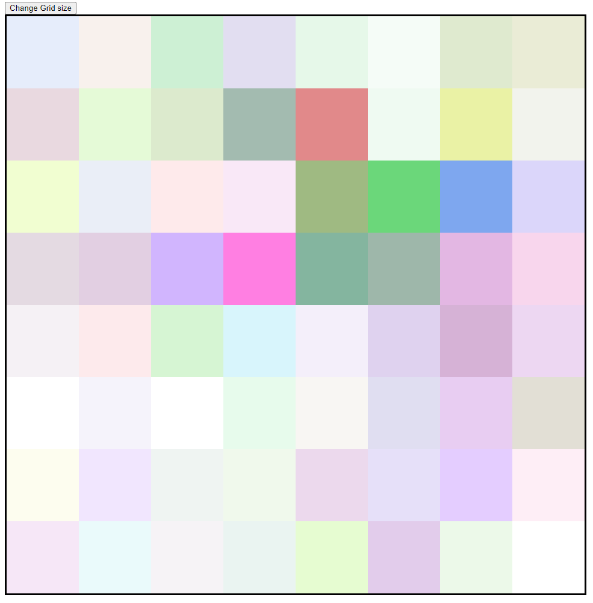

# etch-a-sketch

A Etch-A-Sketch game made with HTML, CSS and JavaScript.

## Overview

- Change the grid size
- On hover a Pixel changes its Color
- Random color is picked every time
- Every time the color changes the opacity increases

## Live Page

View the Homepage [here](https://imbajanox.github.io/etch-a-sketch/)

## Look

